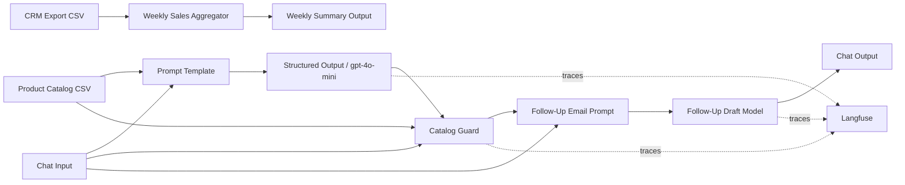

# AI SalesGenie

AI SalesGenie is an agentic sales assistant for Oak & Ember Interiors. Built in Langflow, it routes inbound messages, extracts and qualifies leads, recommends products from an approved catalog, validates recommendations deterministically, drafts grounded follow-up emails, and produces weekly sales insights. Langfuse provides execution traces, model usage, latency, cost, and human evaluation scores.

## Architecture



The inquiry workflow uses a sequential pipeline with routing at extraction time. A deterministic Catalog Guard is the final authority for product IDs, prices, availability, descriptions, and budget compliance. Weekly aggregation runs as a separate deterministic flow.

## Capabilities

- Routes sales inquiries, product questions, stock questions, competitor comparisons, complaints, spam, and weekly-summary requests.
- Extracts identity, product interest, budgets, quantity, urgency, deadline, requirements, and competitor mentions.
- Qualifies valid leads as Hot, Warm, or Cold.
- Recommends one to three in-stock products from the supplied catalog.
- Prevents over-budget, unavailable, unknown, and cross-row product claims.
- Drafts personalized follow-up emails without automatically sending them.
- Produces traceable weekly lead-tier, category, and budget summaries.
- Captures model, token, latency, cost, input/output, and human-score evidence in Langfuse.

## Repository contents

| Path | Contents |
|---|---|
| `langflow/` | Two operational Langflow flows and their custom Python components |
| `prompts/` | Versioned routing, recommendation, follow-up prompts, and schemas |
| `data/input/` | Catalog, CRM sample, inquiries, and T1-T11 evaluation inputs |
| `evaluation/` | Baseline results, extended-capability results, and Langfuse evidence |
| `docs/` | BRD, PRD, implementation guides, data notes, and observability strategy |
| `activity/` | Chronological implementation and decision log |

## Documents

- [Business Requirements Document](docs/BRD_AI_SalesGenie.md) ([Word version](docs/BRD_AI_SalesGenie.docx))
- [Product Requirements Document](docs/PRD_AI_SalesGenie.md) ([Word version](docs/PRD_AI_SalesGenie.docx))
- [Operational workflow guide](docs/AI_SalesGenie_Workflow_Guide.docx)
- [Observability and evaluation strategy](docs/observability_strategy.md)
- [Baseline T1-T11 results](evaluation/baseline_results.md)
- [Extended follow-up capability results](evaluation/extended_capability_results.md)
- [Langfuse evidence index](evaluation/evidence/langfuse/README.md)

## Import and run

1. Install and start Langflow.
2. Import the required JSON flows from `langflow/`:
   - `02_catalog_recommender_followup.json`
   - `03_weekly_summary.json`
3. Configure `OPENAI_API_KEY` as an environment variable or Langflow secret.
4. Upload `data/input/product_catalog.csv` to the Catalog Recommender Read File component.
5. Upload `data/input/crm_export_sample.csv` to the Weekly Summary Read File component.
6. Open Playground and run the inquiry-processing flow or the weekly-summary flow. The inquiry flow already includes routing, lead extraction, catalog recommendation, deterministic validation, and follow-up drafting.

For Langfuse US tracing, configure project-scoped credentials outside source control:

```text
LANGFUSE_PUBLIC_KEY=pk-lf-...
LANGFUSE_SECRET_KEY=sk-lf-...
LANGFUSE_BASE_URL=https://us.cloud.langfuse.com
```

Restart Langflow after changing environment variables.

## Evaluation status

- Mandatory baseline: T1-T11 required behaviors passed.
- Grounding control: deterministic validation against exact catalog rows.
- Extended capability: automated follow-up email drafting.
- Representative traced recommendation: 3,772 model tokens, $0.000787, and 6.40 seconds combined model latency.
- Human evaluation: `overall_pass: True` recorded for a grounded recommendation and spam edge case.

See `evaluation/baseline_results.md` for limitations and detailed results. Costs and latency are trace-specific and should not be treated as production forecasts.

## Security and privacy

- Exported flow files contain no raw OpenAI or Langfuse API secrets.
- Do not commit `.env` files, credentials, tokens, or production customer data.
- The included data is sample/evaluation material.
- Follow-up output remains draft-only; a human must review before sending.
- Production rollout requires OAuth, role-based access, audit logging, redaction, and a retention policy.

## Technology

- Langflow
- OpenAI `gpt-4o-mini`
- Python custom components
- Langfuse
- CSV catalog and CRM sample data

## Author

Prasanth Rasam
